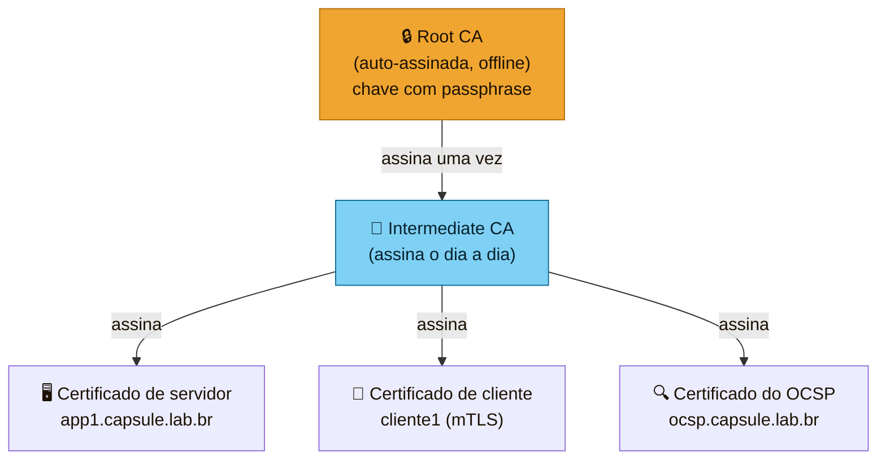
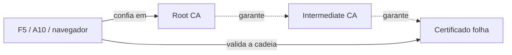
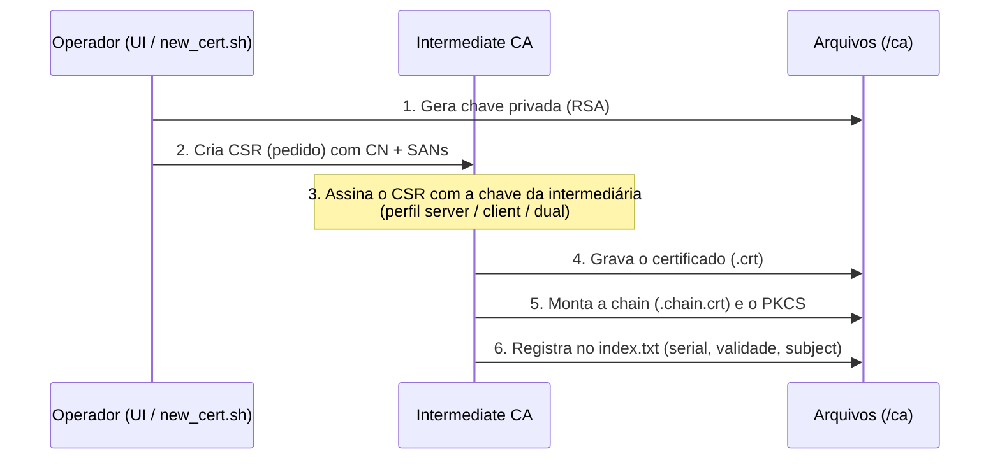
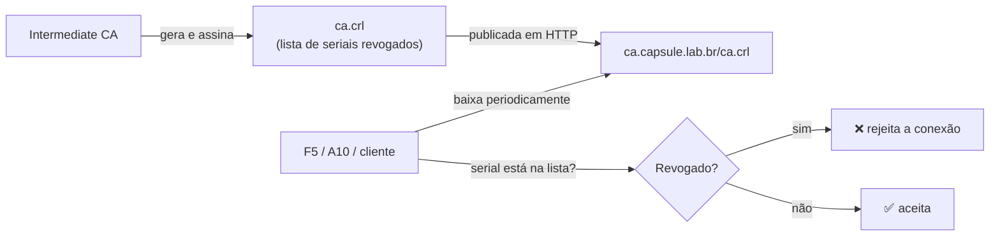
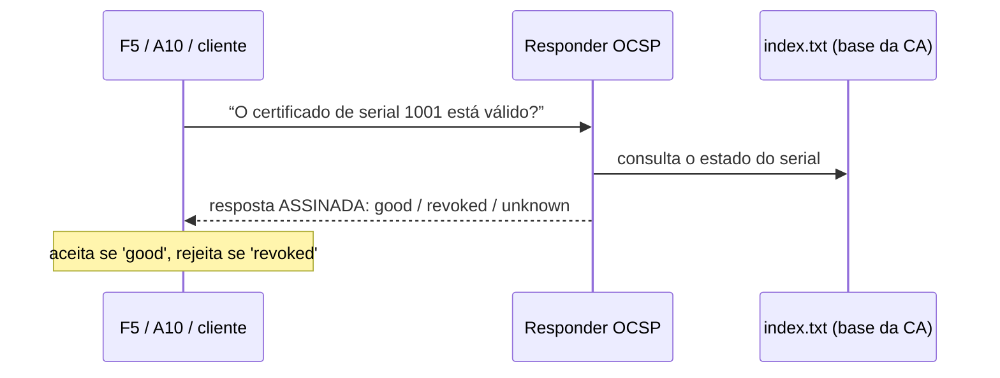
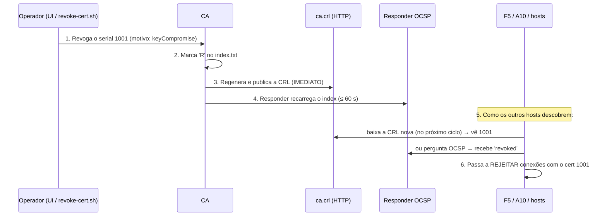
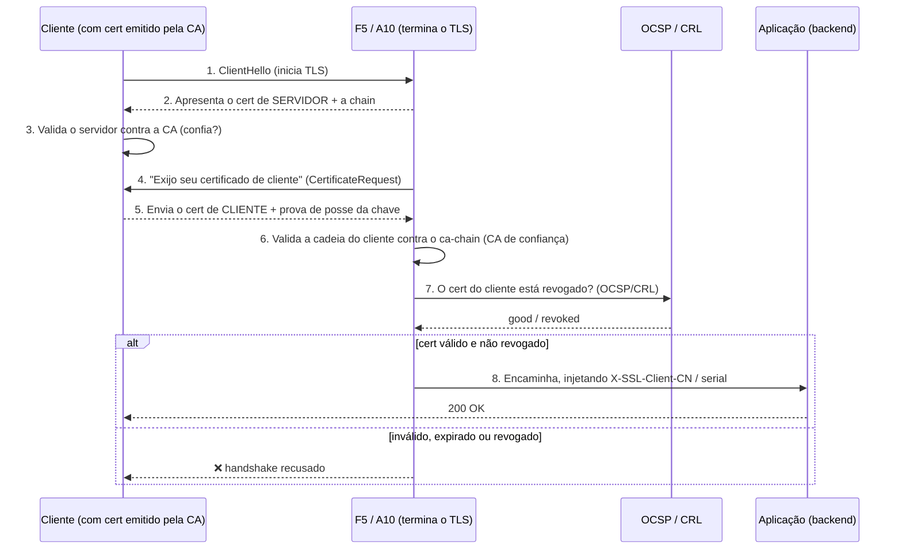

# Como funciona a PKI da Capsule Corp — fluxo dos certificados

Documento de referência da CA interna: hierarquia, emissão, distribuição,
revogação (CRL e OCSP) e como tudo isso é usado no **mTLS** dos balanceadores
F5 BIG-IP e A10 Thunder.

> Ao longo do texto usamos o domínio de exemplo `capsule.lab.br`. Na sua
> instância vale o domínio/organização escolhidos no assistente de configuração.

---

## 1. Visão geral em uma frase

Uma **Autoridade Certificadora (CA)** é uma entidade em quem todos concordam em
confiar. Ela **assina** certificados digitais. Um certificado é, na prática, uma
**identidade** (ex.: “sou o `app1.capsule.lab.br`”) **carimbada** pela CA. Quem
confia na CA passa a confiar em qualquer identidade que ela carimbou — até que
esse carimbo seja **revogado** ou **expire**.

---

## 2. A hierarquia: Root CA e Intermediate CA

Usamos **duas camadas**. A **Root CA** (raiz) é a âncora de confiança; a
**Intermediate CA** (intermediária) é quem trabalha no dia a dia.

**Por que duas camadas?**

- A **raiz assina apenas a intermediária** — e só isso. Depois disso, a chave
  privada da raiz fica **trancada** (protegida por passphrase, idealmente
  removida da máquina). Ela quase nunca é usada.
- A **intermediária assina tudo o resto** (servidores, clientes, OCSP). Se a
  chave da intermediária for comprometida, você **revoga a intermediária** e
  emite uma nova — sem precisar reinstalar a raiz em todos os F5/A10.
- No mTLS, os balanceadores precisam validar a **cadeia completa**
  (folha → intermediária → raiz). Duas camadas é o cenário real que se treina.

**Quem confia em quem:**

O ponto de confiança que você instala nos F5/A10 e nos servidores é o
**`ca-chain.crt`** (intermediária + raiz). Basta confiar na raiz para,
por transitividade, confiar em tudo que a intermediária assinou.

---

## 3. Quem assina os certificados

Um certificado nunca “se auto-declara” válido — ele é **assinado
criptograficamente** pela chave privada da CA que o emitiu.

| Certificado | Assinado por | Chave usada |
|---|---|---|
| Root CA | ela mesma (**auto-assinada**) | chave privada da raiz |
| Intermediate CA | **Root CA** | chave privada da raiz |
| Servidor / Cliente / OCSP | **Intermediate CA** | chave privada da intermediária |

A assinatura funciona assim: a CA calcula um *hash* do conteúdo do certificado
(SHA-256, por padrão) e cifra esse hash com sua **chave privada**. Qualquer um
com o **certificado da CA** (que contém a chave pública) consegue verificar que
a assinatura bate — provando que aquele certificado foi realmente emitido por
essa CA e não foi adulterado.

---

## 4. Ciclo de vida: emissão de um certificado

O que vai **dentro** de cada certificado folha (é isso que o torna útil):

- **Subject / CN** — a identidade (ex.: `app1.capsule.lab.br`).
- **SANs** — os nomes/IPs válidos (`DNS:app1...`, `IP:10.0.0.10`). Clientes TLS
  modernos validam o SAN, não o CN.
- **Extended Key Usage (EKU)** — para que serve: `serverAuth` (servidor),
  `clientAuth` (cliente mTLS) ou os dois (dual).
- **AIA (Authority Information Access)** — onde buscar o certificado da CA
  emissora e o **endereço do OCSP**.
- **CRL Distribution Points** — o **endereço da CRL**.
- **Validade** (notBefore / notAfter).

Esses três últimos são o que liga o certificado ao mecanismo de revogação.

---

## 5. Distribuição: o que o certificado “aponta”

Todo certificado folha carrega, embutido, os endereços de onde verificar sua
validade. Servidos por HTTP (de propósito — AIA/CRL/OCSP usam HTTP):

| Dentro do certificado | Endereço (exemplo) | Para quê |
|---|---|---|
| CRL Distribution Point | `http://ca.capsule.lab.br/ca.crl` | baixar a lista de revogados |
| AIA · OCSP | `http://ocsp.capsule.lab.br` | perguntar “esse cert está revogado?” |
| AIA · caIssuers | `http://ca.capsule.lab.br/intermediate.crt` | quem me emitiu (montar a cadeia) |

O host `ca.` distribui os artefatos públicos (`ca.crt`, `intermediate.crt`,
`ca-chain.crt`, `ca.crl`, `root.crl`); o host `ocsp.` responde consultas OCSP.

---

## 6. CRL — Certificate Revocation List

A **CRL** é uma **lista assinada** de certificados que foram **revogados antes
de expirar**. Pense numa “lista negra” publicada pela CA.

Pontos-chave:

- A CRL é **assinada pela CA** — ninguém consegue forjar.
- Ela tem **validade curta** (aqui, 30 dias). Por isso é **regerada
  periodicamente** (diariamente), **mesmo sem novas revogações** — senão os
  clientes passam a considerá-la “vencida” e podem rejeitar tudo.
- Cada camada tem sua CRL: a **`ca.crl`** (da intermediária) revoga os
  **certificados folha**; a **`root.crl`** (da raiz) revogaria a **intermediária**.
- **Vantagem:** simples, offline (baixa uma vez, valida vários).
  **Desvantagem:** o cliente pode ter uma CRL “velha” — a revogação só é vista
  na próxima atualização.

---

## 7. OCSP — Online Certificate Status Protocol

O **OCSP** resolve a desvantagem da CRL: em vez de baixar a lista inteira, o
cliente **pergunta em tempo real** sobre **um** certificado específico.

- A resposta é **assinada** pelo certificado do responder OCSP (que a
  intermediária emitiu com o EKU `OCSPSigning`) — por isso é confiável.
- **`good`** = válido; **`revoked`** = revogado; **`unknown`** = a CA não
  conhece esse serial.
- **Vantagem:** status quase em tempo real, tráfego mínimo.
  **Desvantagem:** exige o serviço online.

> **Nota da nossa implementação:** o responder `openssl ocsp` carrega o
> `index.txt` **na inicialização**. Para refletir emissões/revogações recentes,
> o serviço se **recarrega a cada 60 s**. A **CRL é imediata** (republicada na
> hora da revogação); o OCSP acompanha em até ~60 s.

### CRL x OCSP — resumo

| | CRL | OCSP |
|---|---|---|
| Como | baixa a lista toda | pergunta 1 cert |
| Atualidade | depende da validade da lista | quase tempo real |
| Rede | pouca (cacheável) | 1 request por validação |
| Offline | funciona | precisa do responder no ar |
| Aqui | `ca.crl`, regerada diariamente | `ocsp.`, recarrega a cada 60 s |

Na prática, **os dois coexistem**: a CRL é o mecanismo robusto de base; o OCSP dá
a resposta rápida. F5 e A10 suportam ambos.

---

## 8. O que acontece quando um certificado é revogado

Revogar = declarar um certificado **inválido antes de ele expirar** (ex.: chave
vazou, serviço desativado, cert substituído).

**Como os outros hosts da rede sabem?** Eles **não** são “avisados” ativamente —
eles **consultam** os mecanismos que o próprio certificado aponta:

1. **Via CRL:** o F5/A10 baixa `ca.crl` periodicamente (conforme a validade da
   lista) e passa a bloquear qualquer serial que apareça nela.
2. **Via OCSP:** a cada validação (ou com cache curto), o F5/A10 pergunta ao
   responder e recebe `revoked`.

**Janela de propagação:** a revogação **não** é instantânea em todos os pontos.
A CRL é republicada na hora, mas cada host só “enxerga” na próxima vez que
baixar a lista / consultar o OCSP. Por isso o motivo importa: para
**comprometimento de chave** (`keyCompromise`), o ideal é usar OCSP (janela de
segundos) e/ou forçar atualização da CRL nos balanceadores.

**Daí em diante:** o serial fica na CRL até o certificado **expirar
naturalmente** — depois disso ele sai da lista (um cert expirado já é inválido
por si só, não precisa constar como revogado).

---

## 9. mTLS — como tudo isso se junta

No **TLS normal**, só o **servidor** apresenta certificado (o cliente confere que
está falando com o servidor certo). No **mTLS (mutual TLS)**, **os dois lados**
apresentam certificado: o balanceador **exige** um certificado de **cliente**
válido — emitido pela sua CA e **não revogado** — senão recusa a conexão.

O que o F5/A10 precisa configurado para isso funcionar:

- **CA de confiança** = `ca-chain.crt` (para validar o cert do cliente).
- **Client Certificate = require** (exige o cert de cliente).
- **Fonte de revogação** = CRL (`ca.crl`) e/ou **OCSP** (`ocsp.`).
- Opcional: repassar a identidade do cliente ao backend via cabeçalhos
  (`X-SSL-Client-CN`, serial) por iRule (F5) / aFleX (A10).

Assim, uma aplicação atrás do balanceador só é acessada por clientes que
**possuem uma chave privada** cujo certificado **a sua CA emitiu** e que **não
foi revogado** — e o backend ainda sabe **quem** é o cliente.

---

## 10. Resumo do papel de cada peça

| Peça | Papel |
|---|---|
| **Root CA** | âncora de confiança; assina só a intermediária; fica trancada |
| **Intermediate CA** | assina servidores, clientes e o OCSP no dia a dia |
| **Certificado folha** | a identidade de um servidor/cliente; carrega AIA/CRL/OCSP |
| **CRL** | lista assinada de revogados; base robusta e cacheável |
| **OCSP** | consulta de status em tempo (quase) real de 1 certificado |
| **AIA / CRL DP** | os endereços embutidos no cert que dizem onde verificar |
| **ca-chain.crt** | intermediária + raiz; o que se instala como confiança |
| **mTLS** | exige cert de cliente válido e não revogado no F5/A10 |

---

## 11. Glossário rápido

- **CSR** — pedido de assinatura (contém a chave pública + a identidade).
- **PKCS#12 / .p12** — pacote com cert + chave privada (usado no A10).
- **EKU** — para que o certificado serve (serverAuth / clientAuth / OCSPSigning).
- **SAN** — nomes/IPs válidos do certificado.
- **AIA** — ponteiros para a CA emissora e para o OCSP.
- **notAfter** — data de expiração.
- **Revogar** — invalidar antes de expirar.
